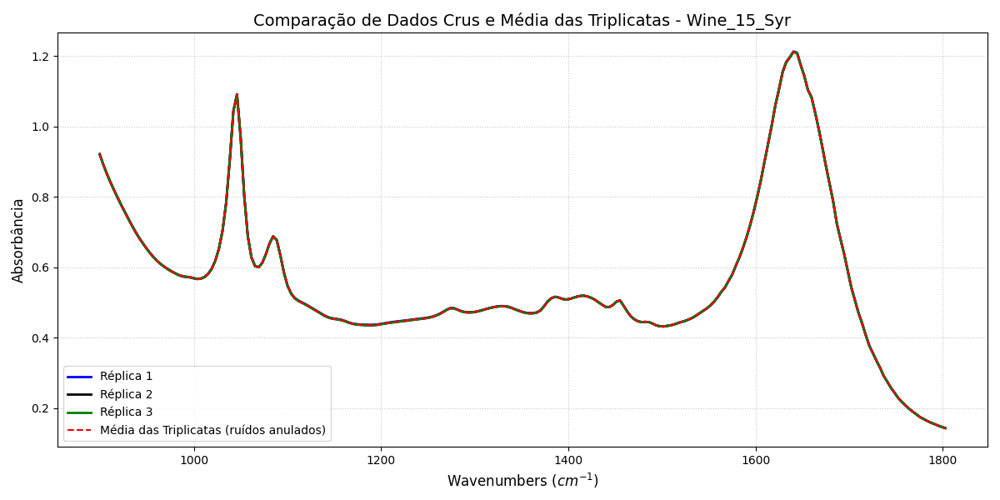
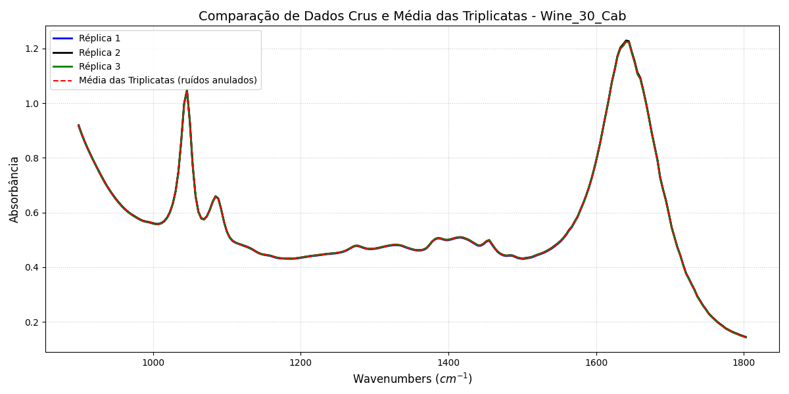

# Imagens da Apresentação — Organização e Finalidade

---

## 1. Pipeline de Segmentação Química via Degrau Unitário
### Arquivo:
`results/passa_bandas_degraus_unitarios.png`

### Objetivo
Mostrar a etapa de **segmentação espectral** do projeto.

### O que a imagem representa
- Espectro FTIR suavizado do vinho
- Regiões químicas selecionadas
- Filtros passa-banda ideais implementados via **degrau unitário deslocado**

### O que explicar
Cada faixa do espectro está associada a compostos químicos:

- Açúcares
- Ácidos orgânicos
- Polifenóis
- Proteínas
- Ésteres

### Mensagem principal
> O sinal foi “fatiado” em regiões químicas específicas para permitir análise individual dos compostos.

---

## 2. Comparação das Triplicatas — Wine 01 (Completo)
### Arquivo:
`results/wine_01_media_triplicata.png`

### Objetivo
Mostrar a redução do ruído experimental através da média das triplicatas.

### O que a imagem representa
- Réplica 1
- Réplica 2
- Réplica 3
- Média das medições

### O que explicar
As diferenças pequenas entre réplicas representam ruído experimental.

Ao calcular a média:
- ruído aleatório tende a cancelar
- sinal real é preservado

### Mensagem principal
> Aplicamos o princípio da superposição para melhorar a relação sinal-ruído.

---

## 3. Zoom-In das Triplicatas (Região 1)
### Arquivo:
`results/wine_01_media_triplicatas_ZOOM_IN_1.png`

### Objetivo
Evidenciar diferenças sutis invisíveis no gráfico completo.

### O que explicar
No gráfico global as curvas parecem iguais, mas o zoom mostra:

- pequenas oscilações entre medições
- ganho obtido com a média

### Mensagem principal
> O zoom evidencia a redução do ruído inter-amostral.

---

## 4. Zoom-In das Triplicatas (Região 2)
### Arquivo:
`results/wine_01_media_triplicatas_ZOOM_IN_2.png`

### Objetivo
Reforçar a evidência experimental do cancelamento do ruído.

### Mensagem principal
> Mesmo em regiões de pico, a média reduz variações sem distorcer o sinal.

---

## 5. Comparação dos Filtros — Wine 01
### Arquivo:
`results/wine_01.png`

### Objetivo
Comparar os filtros utilizados no processamento.

### O que a imagem representa
- Sinal bruto
- Média móvel (FIR)
- Savitzky–Golay

### O que explicar
A média móvel:
- reduz ruído
- pode suavizar excessivamente picos estreitos

Savitzky–Golay:
- suaviza o ruído
- preserva forma, largura e amplitude dos picos

### Mensagem principal
> O filtro Savitzky–Golay preservou melhor as características espectrais relevantes.

---

## 6. Comparação dos Filtros — Wine 15
### Arquivo:
`results/wine_15_syr.png`

### Objetivo
Mostrar consistência do método em outro vinho.

### Mensagem principal
> O comportamento dos filtros se manteve consistente entre amostras diferentes.

---

## 7. Comparação dos Filtros — Wine 30
### Arquivo:
`results/wine_30_cab.png`

### Objetivo
Validar generalização do processamento.

### Mensagem principal
> O pipeline funcionou adequadamente para diferentes espectros.

---

## 8. Média das Triplicatas — Wine 15
### Arquivo:
`results/wine_15_syr_media_triplicatas.png`

### Objetivo
Mostrar robustez do método de média.

### Mensagem principal
> O cancelamento do ruído se repete entre amostras distintas.

---

## 9. Média das Triplicatas — Wine 30
### Arquivo:
`results/wine_30_cab_media_triplicatas.png`

### Objetivo
Demonstrar consistência experimental.

### Mensagem principal
> A estratégia de média apresentou comportamento estável entre os vinhos.

---

## 10. Comparação Entre Vinhos (Passa-Bandas)
### Arquivo:
`results/compara_passa_bandas_wine01_wine15.png`

### Objetivo
Comparar diferenças químicas entre amostras.

### O que explicar
Após o isolamento das bandas:
- cada vinho apresenta intensidades diferentes
- isso sugere diferenças composicionais

### Mensagem principal
> O processamento permitiu transformar espectros em informação comparável.

---

## 11. Assinatura Espectral Média — Savitzky–Golay
### Arquivo:
`results/concentracao_compostos_sg.png`

### Objetivo
Comparar a **energia média integrada das bandas químicas** entre Cabernet e Shiraz utilizando o processamento via **Savitzky–Golay**.

### O que a imagem representa
Média das áreas espectrais por classe:

- Açúcares
- Ácidos orgânicos
- Polifenóis
- Proteínas
- Aromas (Ésteres)

### O que explicar
A área integrada da banda é usada como uma métrica de concentração relativa espectral.

A comparação mostra:
- quais compostos tendem a ser mais intensos
- diferenças químicas médias entre as uvas

### Mensagem principal
> O processamento permitiu construir uma assinatura química média das classes.

---

## 12. Assinatura Espectral Média — Média Móvel
### Arquivo:
`results/concentracao_compostos_ma.png`

### Objetivo
Comparar os mesmos compostos químicos após filtragem por **Média Móvel FIR**.

### O que explicar
Esse gráfico permite comparar:

- robustez das métricas
- consistência do processamento
- diferenças entre estratégias de filtragem

### Observação importante
Se os resultados forem muito semelhantes ao SG:

> provavelmente vale mostrar apenas um deles na apresentação final (preferencialmente SG).

### Mensagem principal
> As métricas químicas permaneceram estáveis independentemente do filtro aplicado.

---

## 13. Espaço de Separação — Polifenóis vs Aromas
### Arquivo:
`results/espaco_separacao_sg.png`

### Objetivo
Verificar se as métricas extraídas conseguem **separar Cabernet e Shiraz** no espaço de características.

### O que a imagem representa
Cada ponto do gráfico representa **um vinho**.

Os eixos representam:

- **X:** Energia da banda de Polifenóis (Taninos)
- **Y:** Energia da banda de Ésteres (Aromas)

### O que explicar
Esse gráfico investiga:

> “Os vinhos ocupam regiões diferentes do espaço químico?”

Se houver agrupamentos distintos:

- o método extraiu características discriminantes
- existe potencial de classificação entre uvas

### Observação importante
Se Cabernet e Shiraz estiverem muito misturados:

> isso sugere que essas duas features sozinhas não são suficientes para separar as classes.

### Mensagem principal
> O espaço de características permite avaliar o potencial de diferenciação química entre variedades.

---

## 14. Radar Plot — Identidade Espectral Multidimensional
### Arquivo:
`results/identidade_espectral.png`

### Objetivo
Mostrar a **assinatura química média multidimensional** das variedades de uva.

### O que a imagem representa
Perfil médio espectral considerando simultaneamente:

- Açúcares
- Ácidos
- Polifenóis
- Proteínas
- Aromas

Cada polígono representa uma classe:

- Cabernet
- Shiraz

### O que explicar
O formato do polígono representa a “identidade química” média da classe.

Diferenças entre áreas indicam:

- predominância relativa de compostos
- variações composicionais

### Observação importante
Neste experimento, Cabernet e Shiraz ficaram muito próximos.

Isso sugere:

> perfis químicos médios semelhantes nas bandas analisadas.

### Mensagem principal
> O radar resume a assinatura espectral média das variedades em um único gráfico multidimensional.