# Sugestao de Apresentacao - Analise de Sinais e Sistemas

**Tema:** Processamento Digital de Sinais aplicado a espectros FTIR de vinhos  
**Duracao total:** 15 minutos  
**Divisao sugerida:** 3 partes de 5 minutos  
**Ideia central:** mostrar como um espectro FTIR pode ser tratado como um sinal discreto, processado por sistemas digitais e transformado em metricas quimicas comparaveis.

---

## Resumo da Estrutura

| Parte | Tempo | Foco | Slides |
|---|---:|---|---:|
| Parte 1 | 5 min | Introducao teorica, FTIR, pipeline geral, modelagem e media das triplicatas | 1 a 6 |
| Parte 2 | 5 min | Filtros de suavizacao e filtros passa-banda | 7 a 11 |
| Parte 3 | 5 min | Sistema acumulador discreto, metricas e resultados | 12 a 16 |

**Mensagem final da apresentacao:** o projeto usa uma cascata de sistemas discretos para reduzir ruido, preservar picos espectrais, isolar bandas quimicas e extrair areas/picos que servem como assinatura espectral dos vinhos.

---

# Parte 1 - Introducao, FTIR, Pipeline, Modelagem e Media das Triplicatas (~5 min)

## Slide 1 - Tema, Problema e Objetivo (~35 a 40 s)

**Titulo sugerido:**  
**Processamento Digital de Sinais em Espectros FTIR de Vinhos**

**Fala sugerida:**

O trabalho aplica conceitos de Analise de Sinais e Sistemas em dados reais de espectroscopia FTIR de vinhos Cabernet Sauvignon e Shiraz. O problema e que o espectro medido tem ruido experimental, pequenas diferencas entre replicatas e muitas regioes quimicas misturadas no mesmo sinal.

O objetivo foi criar um pipeline de processamento digital para:

- reduzir ruido;
- preservar picos de absorbancia;
- isolar regioes associadas a compostos quimicos;
- extrair metricas numericas para comparar vinhos.

**Dados usados no projeto:**

- 37 vinhos unicos;
- 3 replicatas por vinho, totalizando 111 espectros;
- 235 pontos por espectro;
- faixa medida: aproximadamente 899 a 1803 cm^-1;
- 19 amostras Cabernet e 18 Shiraz.

**Conexao com o codigo:**  
Em `src/main.py`, o pipeline comeca carregando o CSV com `utils.load_data(utils.file_path)`. A funcao em `src/utils.py` usa `pandas.read_csv` e define `Wavenumbers` como indice, isto e, o eixo independente do sinal.

---

## Slide 2 - O que e FTIR e por que isso vira um sinal? (~50 a 55 s)

**Titulo sugerido:**  
**FTIR: uma assinatura espectral do vinho**

**Fala sugerida:**

FTIR significa *Fourier Transform Infrared*. O equipamento mede como a amostra absorve radiacao infravermelha. Cada ligacao molecular vibra mais intensamente em certas regioes de numero de onda, entao o espectro funciona como uma assinatura quimica.

Um detalhe importante para a disciplina: o arquivo que usamos ja nao e o interferograma bruto do equipamento. O FTIR ja aplicou uma Transformada de Fourier internamente e entregou um espectro no dominio do numero de onda.

Assim, no projeto, nao tratamos o eixo horizontal como tempo. Tratamos o numero de onda como uma variavel discreta:

$$
n = 0, 1, 2, \ldots, 234
$$

e a absorbancia como amplitude:

$$
x[n] = \text{absorbancia no numero de onda associado ao indice } n
$$

**Grafico para mostrar:**

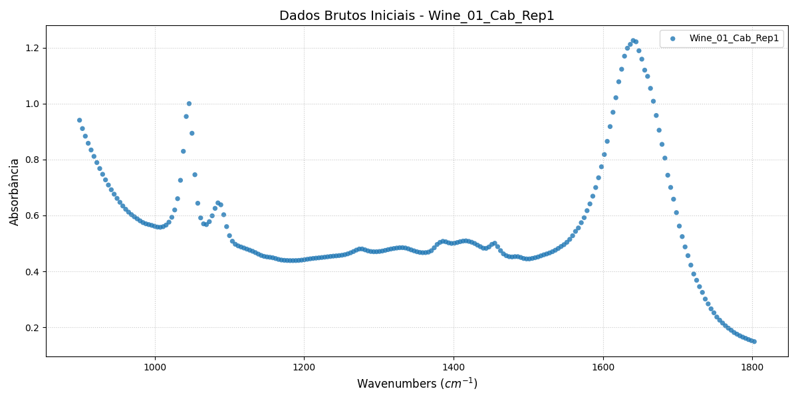

**Como explicar o grafico:**  
Use os pontos brutos para mostrar como o dado chega inicialmente: uma sequencia discreta de amostras de absorbancia. O eixo x e o numero de onda em cm^-1, e o eixo y e a absorbancia. Os picos e vales indicam regioes onde compostos do vinho absorvem mais ou menos energia.

---

## Slide 3 - Pipeline Geral do Projeto (~20 a 30 s)

**Titulo sugerido:**  
**Pipeline geral do trabalho**

**Grafico para mostrar:**

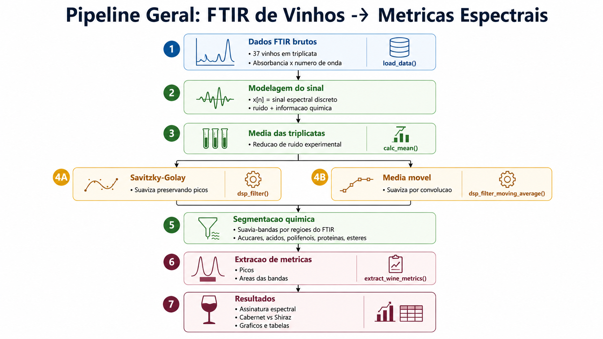

**Fala sugerida:**

Antes de detalhar cada etapa, esse fluxograma resume o caminho geral do trabalho. Começamos com os dados FTIR brutos, modelamos cada espectro como um sinal discreto, calculamos a média das triplicatas, comparamos dois filtros de suavização, segmentamos as regiões químicas e extraímos métricas para comparar os vinhos.

Agora vamos começar a detalhar esse fluxo pela modelagem do sinal e pelo primeiro pré-processamento: a média das triplicatas.

**Mensagem principal:**  
Esse slide serve como mapa da apresentação. Não é necessário explicar todos os blocos agora; cada parte será retomada nos próximos slides.

---

## Slide 4 - Modelagem do Sinal e do Sistema (~50 s)

**Titulo sugerido:**  
**Modelo discreto: sinal real + ruido**

**Fala sugerida:**

Cada espectro pode ser modelado como:

$$
x[n] = v[n] + e[n]
$$

onde:

- $x[n]$ e o sinal medido;
- $v[n]$ e a parte deterministica, associada a composicao quimica real;
- $e[n]$ e o ruido experimental do sensor e da medicao.

O codigo atua como uma cascata de sistemas discretos:

$$
x[n] \rightarrow \text{media das triplicatas} \rightarrow \text{suavizacao} \rightarrow \text{passa-bandas} \rightarrow \text{metricas}
$$

Essa cascata e uma forma pratica de pensar o projeto como um conjunto de sistemas que recebem uma sequencia de entrada e produzem uma sequencia ou um conjunto de metricas de saida.

**Conexao com o codigo:**  
Em `src/main.py`, depois do carregamento, o codigo chama:

```python
df_mean = utils.calc_mean(df)
```

Depois percorre cada vinho e aplica:

```python
sinal_limpo_sg = utils.dsp_filter(df_mean[coluna])
sinal_limpo_ma = utils.dsp_filter_moving_average(df_mean[coluna])
metrics_sg = utils.extract_wine_metrics(sinal_limpo_sg)
```

Ou seja, o processamento segue exatamente a ordem teorica: entrada, reducao de ruido, filtragem e extracao de metricas.

---

## Slide 5 - Primeiro Filtro: Media das Triplicatas (~1 min 5 s)

**Titulo sugerido:**  
**Media das triplicatas como sistema linear**

**Grafico para mostrar:**

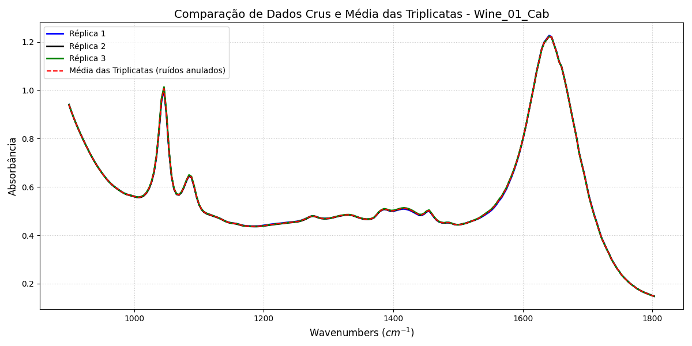

**Fala sugerida:**

Cada vinho foi medido tres vezes. Essas tres curvas representam o mesmo sinal fisico, mas com pequenas variacoes experimentais. A primeira etapa do projeto foi calcular a media:

$$
y_{\text{mean}}[n] =
\frac{x_1[n] + x_2[n] + x_3[n]}{3}
$$

Se cada replicata for escrita como:

$$
x_i[n] = v[n] + e_i[n]
$$

entao:

$$
y_{\text{mean}}[n] =
v[n] + \frac{e_1[n] + e_2[n] + e_3[n]}{3}
$$

Como o ruido aleatorio tende a ter media zero, a media reduz a componente aleatoria e preserva o sinal quimico comum as tres medicoes.

**Conexao com Sinais e Sistemas:**  
Essa etapa usa linearidade e superposicao: somar sinais e multiplicar por $1/3$ e uma combinacao linear.

**Conexao com o codigo:**  
Em `utils.calc_mean`, as colunas sao agrupadas pelo nome do vinho, removendo o sufixo da replicata (`Rep1`, `Rep2`, `Rep3`), e depois o codigo calcula a media por grupo:

```python
wine_tags = [col.rsplit('_', 1)[0] for col in df.columns]
df_mean = df.groupby(wine_tags, axis=1).mean()
```

---

## Slide 6 - Evidencia Visual da Reducao de Ruido (~45 a 50 s)

**Titulo sugerido:**  
**Zoom: por que a media importa?**

**Grafico para mostrar:**

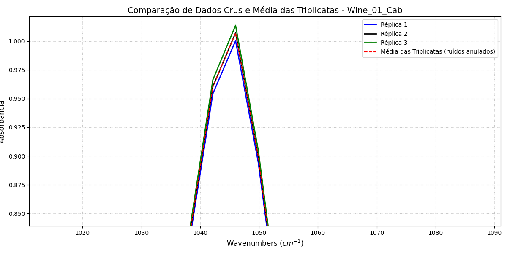

**Fala sugerida:**

No grafico completo, as tres replicatas parecem quase iguais. O zoom mostra melhor as pequenas diferencas entre elas. Essas diferencas sao justamente a variabilidade que queremos reduzir antes de aplicar filtros mais elaborados.

A media nao tenta mudar a forma do espectro. Ela apenas consolida as tres medicoes em um unico sinal mais robusto. Por isso ela e um bom primeiro estagio: diminui variabilidade experimental antes de qualquer suavizacao.

**Grafico opcional, se sobrar tempo:**

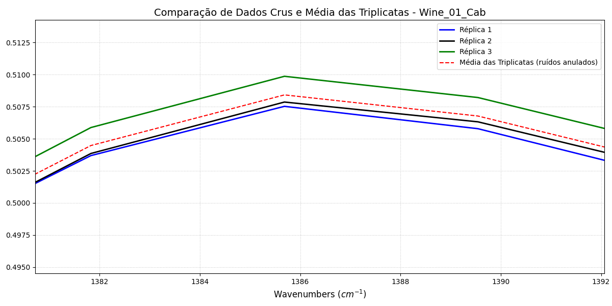

**Fechamento da Parte 1:**  
Ate aqui, transformamos o problema quimico em um problema de sinais: um vetor discreto de 235 amostras, com ruido, que pode ser processado por sistemas digitais.

---

# Parte 2 - Filtros de Suavizacao e Filtros Passa-Banda (~5 min)

## Slide 7 - Por que filtrar depois da media? (~40 s)

**Titulo sugerido:**  
**Ruido intra-amostral e suavizacao**

**Fala sugerida:**

Mesmo depois da media das triplicatas, o espectro ainda pode apresentar oscilacoes pequenas de ponto a ponto. Na linguagem de sinais, essas variacoes rapidas aparecem como componentes de alta frequencia discreta.

Como os picos quimicos reais costumam ser estruturas mais largas e coerentes, aplicamos filtros passa-baixas para atenuar flutuacoes rapidas sem destruir as bandas importantes.

**Conexao com o codigo:**  
Essa etapa aparece em duas funcoes:

- `utils.dsp_filter`: Savitzky-Golay;
- `utils.dsp_filter_moving_average`: media movel via convolucao.

---

## Slide 8 - Filtro de Media Movel FIR (~1 min)

**Titulo sugerido:**  
**Media movel: convolucao com uma janela retangular**

**Equacao principal:**

Para uma janela de tamanho $M$:

$$
y[n] = \frac{1}{M}\sum_{k=0}^{M-1} x[n-k]
$$

A resposta ao impulso e:

$$
h[n] =
\begin{cases}
\frac{1}{M}, & 0 \le n \le M-1 \\
0, & \text{caso contrario}
\end{cases}
$$

Logo, a filtragem e uma convolucao discreta:

$$
y[n] = x[n] * h[n]
$$

**Fala sugerida:**

A media movel e um filtro FIR passa-baixas simples. Ela substitui cada ponto por uma media de seus vizinhos. Isso reduz ruido, mas tem uma limitacao: se a janela for grande demais, os picos podem ficar achatados ou alargados.

**Conexao com o codigo:**  
Em `utils.dsp_filter_moving_average`, a resposta ao impulso e criada por:

```python
h_n = np.ones(janela) / janela
sinal_filtrado = np.convolve(serie_sinal, h_n, mode='same')
```

No codigo principal, essa funcao e usada para comparar a estrategia propria de convolucao com o filtro Savitzky-Golay.

---

## Slide 9 - Filtro Savitzky-Golay (~1 min)

**Titulo sugerido:**  
**Savitzky-Golay: suavizar preservando picos**

**Ideia matematica:**

Em vez de fazer uma media simples, o Savitzky-Golay ajusta um polinomio local em uma janela:

$$
p(m) = a_0 + a_1m + a_2m^2
$$

No projeto:

- janela de 11 pontos;
- polinomio de ordem 2.

A saida no ponto central e o valor estimado pelo polinomio. Na pratica, isso tambem pode ser visto como um filtro FIR de coeficientes fixos:

$$
y[n] = \sum_{m=-L}^{L} h_{\text{sg}}[m]x[n-m]
$$

**Fala sugerida:**

Esse filtro e muito usado em espectroscopia porque suaviza sem destruir a altura e a largura dos picos. Isso e importante porque, no nosso problema, os picos carregam informacao quimica.

**Conexao com o codigo:**  
Em `utils.dsp_filter`, o filtro e aplicado por:

```python
savgol_filter(serie_sinal, window_length=11, polyorder=2)
```

Depois o resultado e devolvido como `pandas.Series`, preservando o eixo dos numeros de onda.

---

## Slide 10 - Comparacao Experimental dos Filtros (~1 min 20 s)

**Titulo sugerido:**  
**Original x Media Movel x Savitzky-Golay**

**Grafico principal:**

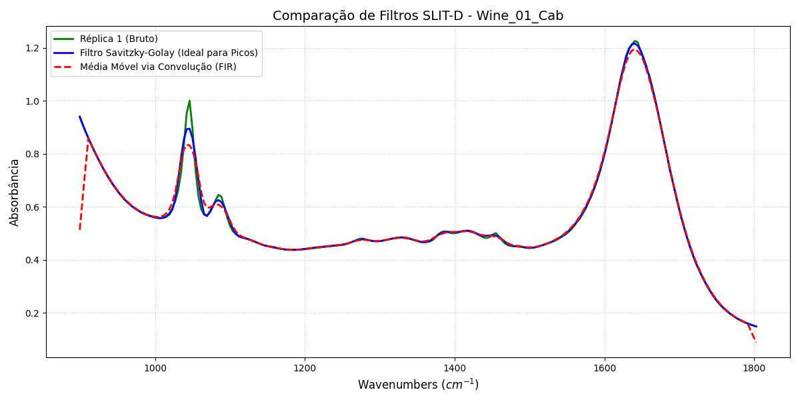

**Fala sugerida:**

Aqui comparamos uma replicata bruta com os dois filtros. A media movel reduz bem o ruido, mas pode suavizar mais fortemente regioes de pico. O Savitzky-Golay acompanha melhor o formato do espectro, preservando picos que depois serao usados para estimar compostos.

**Graficos de apoio, se houver tempo ou como backup:**

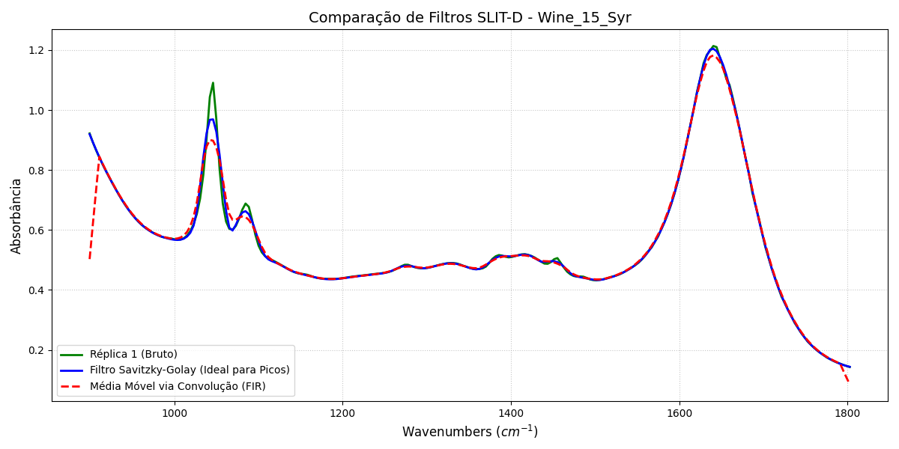

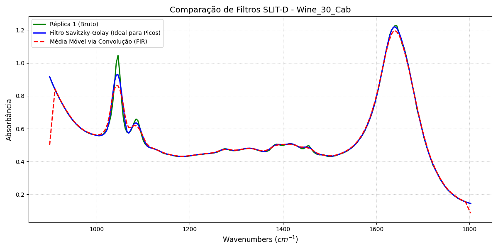

**Resultado numerico importante:**  
As areas extraidas pelos dois filtros ficaram muito proximas. Por exemplo, nas medias por classe:

| Metrica de area | SG Cabernet | SG Shiraz | Media Movel Cabernet | Media Movel Shiraz |
|---|---:|---:|---:|---:|
| Acucares | 152.864 | 153.319 | 152.581 | 153.036 |
| Acidos organicos | 33.895 | 33.912 | 33.908 | 33.925 |
| Polifenois | 98.925 | 98.718 | 99.083 | 98.876 |
| Proteinas | 96.298 | 96.197 | 95.959 | 95.858 |
| Aromas/esteres | 4.302 | 4.289 | 4.327 | 4.314 |

**Interpretacao:**  
As metricas foram estaveis entre os filtros, mas o Savitzky-Golay e mais adequado para preservar a morfologia dos picos. Por isso ele e a melhor escolha para destacar os resultados principais.

---

## Slide 11 - Filtros Passa-Banda por Degraus Unitarios (~1 min)

**Titulo sugerido:**  
**Isolando regioes quimicas do espectro**

**Grafico para mostrar:**

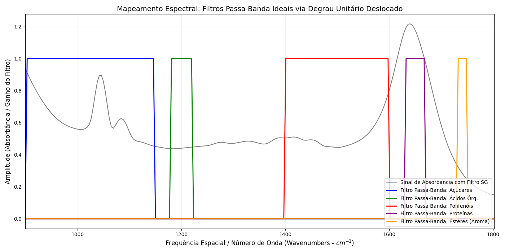

**Fala sugerida:**

Depois da suavizacao, o codigo isola regioes do espectro associadas a grupos quimicos. Matematicamente, cada regiao pode ser descrita por uma janela retangular formada pela diferenca de dois degraus unitarios deslocados:

$$
w[n] = u[n-n_i] - u[n-(n_f+1)]
$$

Aplicar o filtro passa-banda e multiplicar o sinal por essa janela:

$$
y_{\text{banda}}[n] = y[n]w[n]
$$

Na pratica:

- fora da faixa, o sinal e zerado;
- dentro da faixa, o sinal e preservado.

**Faixas usadas no projeto:**

| Composto | Faixa aproximada |
|---|---:|
| Acucares/carboidratos | 900 a 1150 cm^-1 |
| Acidos organicos | 1160 a 1240 cm^-1 |
| Polifenois/taninos | 1400 a 1600 cm^-1 |
| Proteinas/amidas | 1600 a 1700 cm^-1 |
| Esteres/aromas | 1730 a 1750 cm^-1 |

**Conexao com o codigo:**  
Em `utils.extract_wine_metrics`, cada faixa e implementada como uma mascara booleana. Exemplo para aromas:

```python
mask_aroma = (serie_filtrada.index >= 1730) & (serie_filtrada.index <= 1750)
segmento_aroma = serie_filtrada[mask_aroma]
```

Essa mascara e a versao computacional do passa-banda ideal.

---

# Parte 3 - Acumulador Discreto, Metricas e Resultados (~5 min)

## Slide 12 - Comparacao entre Bandas de Vinhos (~50 s)

**Titulo sugerido:**  
**O que muda entre dois vinhos?**

**Grafico para mostrar:**

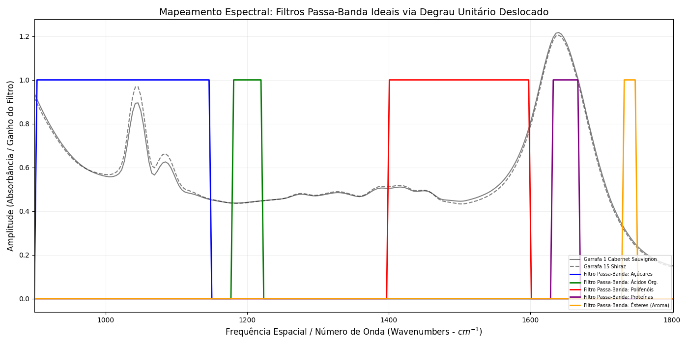

**Fala sugerida:**

Com os passa-bandas, conseguimos comparar regioes especificas entre vinhos diferentes. O grafico mostra um Cabernet e um Shiraz sobrepostos nas regioes de interesse. A ideia nao e olhar somente o espectro inteiro, mas perguntar: em cada faixa quimica, qual vinho tem maior intensidade ou maior area?

**Conexao com o codigo:**  
A funcao `plot_pass_band_all` em `utils.py` carrega as janelas de acucares, acidos, polifenois, proteinas e esteres a partir dos CSVs da pasta `data/`, e sobrepoe essas regioes aos espectros suavizados de `Wine_01_Cab` e `Wine_15_Syr`.

---

## Slide 13 - Pico e Proeminencia Espectral (~50 s)

**Titulo sugerido:**  
**Primeira metrica: intensidade de pico**

**Fala sugerida:**

Para cada banda, o codigo extrai um pico. Mas ele nao usa apenas o maior valor bruto sempre, porque um maximo simples pode ser enganado por uma linha de base alta. A versao corrigida usa proeminencia espectral:

- detecta picos locais;
- mede o quanto o pico se destaca dos vales vizinhos;
- escolhe o pico mais proeminente.

Isso aproxima melhor o que queremos chamar de pico quimico relevante.

**Conexao com Sinais e Sistemas:**  
Detectar picos esta ligado a variacoes locais do sinal. Em termos discretos, mudancas de inclinacao podem ser relacionadas a diferencas como:

$$
d[n] = x[n] - x[n-1]
$$

Um pico ocorre quando a tendencia local muda de subida para descida.

**Conexao com o codigo:**  
Em `utils.get_main_peak`, o codigo usa:

```python
indices, props = find_peaks(segmento, prominence=0.01)
pico_idx = indices[np.argmax(props["prominences"])]
```

Se nenhum pico local for encontrado, o codigo usa `segmento.max()` como fallback.

---

## Slide 14 - Sistema Acumulador Discreto e Area da Banda (~1 min 10 s)

**Titulo sugerido:**  
**Segunda metrica: area como energia/concentracao relativa**

**Fala sugerida:**

A metrica mais importante para comparar as bandas e a area integrada. Em sinais discretos, integrar e acumular amostras. O acumulador discreto ideal pode ser escrito como:

$$
s[n] = s[n-1] + x[n]
$$

Como o eixo real nao e tempo, mas numero de onda, usamos uma integracao numerica no eixo espectral. A regra do trapezio usada no codigo pode ser expressa de forma acumulativa:

$$
s[n] = s[n-1] + \frac{\Delta \nu}{2}\left(y[n] + y[n-1]\right)
$$

onde $\Delta \nu$ e o espacamento entre numeros de onda.

**Conexao fisica:**  
Pela Lei de Beer-Lambert:

$$
A = \varepsilon b c
$$

mantendo constantes o caminho optico e o equipamento, maior absorbancia integrada em uma banda sugere maior concentracao relativa daquele grupo quimico.

**Conexao com o codigo:**  
Em `utils.extract_wine_metrics`, cada segmento filtrado e integrado por:

```python
metrics['area_aroma'] = np.trapezoid(
    segmento_aroma.values,
    x=segmento_aroma.index
)
```

O mesmo padrao e repetido para acucares, acidos, polifenois e proteinas.

---

## Slide 15 - Resultados: Assinatura Espectral Media (~1 min 15 s)

**Titulo sugerido:**  
**Cabernet e Shiraz: assinatura media das bandas**

**Grafico principal:**

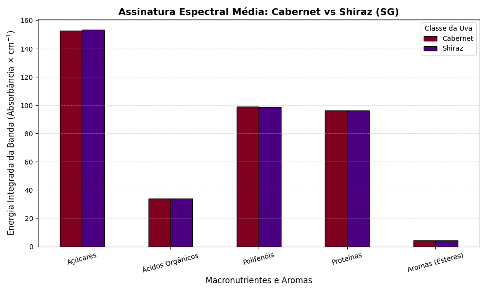

**Grafico de comparacao com media movel, se necessario:**


**Fala sugerida:**

Este grafico resume as areas medias das bandas para Cabernet e Shiraz usando o filtro Savitzky-Golay. Essas areas sao as metricas de concentracao relativa extraidas pelo acumulador discreto.

Os resultados medios ficaram muito proximos entre as duas variedades:

| Banda | Cabernet SG | Shiraz SG | Diferenca Shiraz vs Cabernet |
|---|---:|---:|---:|
| Acucares | 152.864 | 153.319 | +0.30% |
| Acidos organicos | 33.895 | 33.912 | +0.05% |
| Polifenois | 98.925 | 98.718 | -0.21% |
| Proteinas | 96.298 | 96.197 | -0.11% |
| Aromas/esteres | 4.302 | 4.289 | -0.30% |

**Interpretacao para falar:**  
As duas classes apresentam assinaturas medias muito semelhantes nas bandas escolhidas. O metodo funcionou para extrair metricas consistentes, mas essas cinco areas, sozinhas, nao criaram uma separacao forte entre Cabernet e Shiraz.

**Destaques individuais obtidos nos resultados SG:**

- maior area de aroma: `Wine_01_Cab`, com 4.390;
- menor area de aroma: `Wine_25_Cab`, com 4.199;
- maior area de polifenois: `Wine_13_Syr`, com 100.597;
- maior area de acucares: `Wine_15_Syr`, com 157.545;
- maior area de proteinas: `Wine_14_Syr`, com 97.092.

---

## Slide 16 - Separacao, Radar e Conclusao (~1 min)

**Titulo sugerido:**  
**As metricas separam as classes?**

**Graficos para mostrar:**

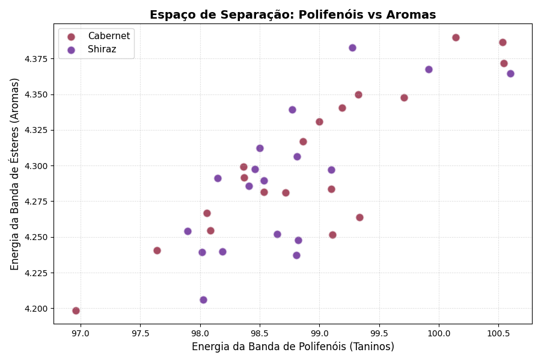

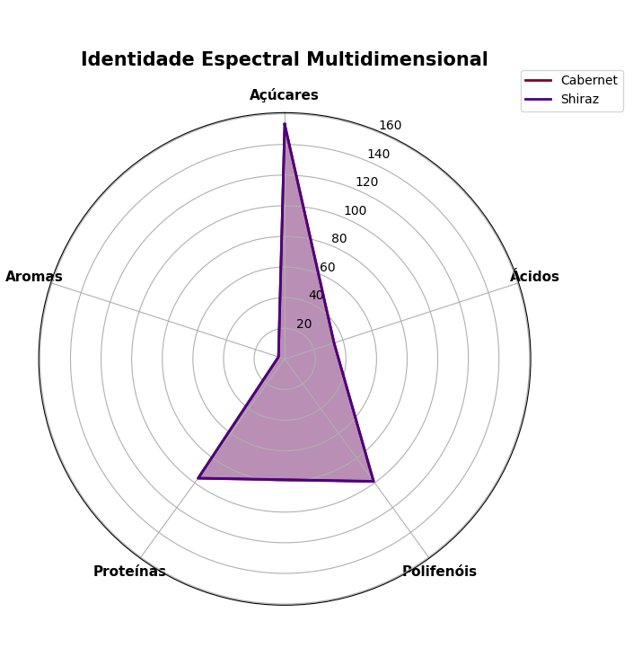

**Fala sugerida:**

O grafico de dispersao usa duas features: area de polifenois e area de aromas. Cada ponto e um vinho. A pergunta e: Cabernet e Shiraz formam grupos separados?

O resultado sugere que essas duas features nao sao suficientes para uma separacao clara, porque as classes ficam proximas. O radar reforca isso: os poligonos medios de Cabernet e Shiraz tem formatos muito parecidos.

Isso nao invalida o processamento. Pelo contrario: mostra uma conclusao importante. O pipeline conseguiu transformar espectros em metricas quantitativas, mas a classificacao entre variedades exigiria mais features ou metodos multivariados, como PCA, LDA ou modelos de aprendizado de maquina.

**Conclusao final:**

O trabalho demonstrou que conceitos de Analise de Sinais e Sistemas aparecem em todas as etapas:

- o espectro FTIR foi modelado como sinal discreto;
- a media das triplicatas aplicou linearidade e superposicao;
- a media movel e o Savitzky-Golay atuaram como filtros FIR passa-baixas;
- os passa-bandas foram modelados por janelas de degrau unitario;
- a area das bandas foi calculada por um acumulador discreto/integrador numerico;
- os resultados geraram uma assinatura espectral comparavel entre vinhos.

---

# Sugestao de Fechamento Oral

Uma frase boa para encerrar:

> "A principal contribuicao do projeto foi mostrar que um espectro FTIR, que a principio parece apenas uma curva quimica, pode ser tratado como um sinal discreto e processado por uma cascata de sistemas. Com isso, reduzimos ruido, isolamos bandas de interesse e extraimos metricas quantitativas para comparar os vinhos."

---

# Ordem Recomendada dos Graficos na Apresentacao

1. `results/dados_iniciais_wine_01_rep1.png` - introduzir o dado bruto como sequencia discreta de pontos.
2. `images/fluxograma_conciso1.png` - apresentar o mapa geral obrigatório do pipeline.
3. `results/wine_01_media_triplicata.png` - mostrar a media das triplicatas.
4. `results/wine_01_media_triplicatas_ZOOM_IN_1.png` - evidenciar a reducao de variabilidade.
5. `results/wine_01.png` - comparar sinal bruto, media movel e Savitzky-Golay.
6. `results/passa_bandas_degraus_unitarios.png` - mostrar as janelas passa-banda.
7. `results/compara_passa_bandas_wine01_wine15.png` - comparar regioes entre dois vinhos.
8. `results/concentracao_compostos_sg.png` - mostrar as areas medias por classe.
9. `results/espaco_separacao_sg.png` - discutir separabilidade.
10. `results/identidade_espectral.png` - fechar com assinatura multidimensional.

**Graficos de backup:**

- `results/wine_15_syr.png`
- `results/wine_30_cab.png`
- `results/wine_15_syr_media_triplicatas.png`
- `results/wine_30_cab_media_triplicatas.png`
- `results/concentracao_compostos_ma.png`

---

# Divisao de Falas por Integrante

## Integrante 1 - Parte 1

**Responsavel por:** problema, FTIR, mapa geral do pipeline, modelagem do sinal, dataset e media das triplicatas.

**Pontos que nao podem faltar:**

- FTIR mede absorbancia em funcao do numero de onda.
- O fluxograma e apenas um mapa rapido; os filtros e resultados serao detalhados pelos proximos integrantes.
- O espectro vira um sinal discreto $x[n]$.
- O modelo usado e $x[n] = v[n] + e[n]$.
- A media das triplicatas reduz ruido aleatorio por superposicao.
- O codigo correspondente e `load_data` + `calc_mean`.

## Integrante 2 - Parte 2

**Responsavel por:** filtros passa-baixas e passa-bandas.

**Pontos que nao podem faltar:**

- Media movel e convolucao com resposta ao impulso retangular.
- Savitzky-Golay ajusta polinomio local e preserva picos.
- Ambos sao filtros FIR passa-baixas.
- Passa-bandas isolam regioes quimicas usando mascaras/degraus.
- O codigo correspondente e `dsp_filter_moving_average`, `dsp_filter` e as mascaras de `extract_wine_metrics`.

## Integrante 3 - Parte 3

**Responsavel por:** metricas, acumulador discreto e resultados.

**Pontos que nao podem faltar:**

- Pico mede intensidade local/proeminencia.
- Area mede energia/concentracao relativa da banda.
- `np.trapezoid` implementa a integracao numerica.
- Cabernet e Shiraz ficaram muito proximos nas metricas medias.
- O pipeline e valido, mas a separacao de classes exigiria mais atributos/metodos.
